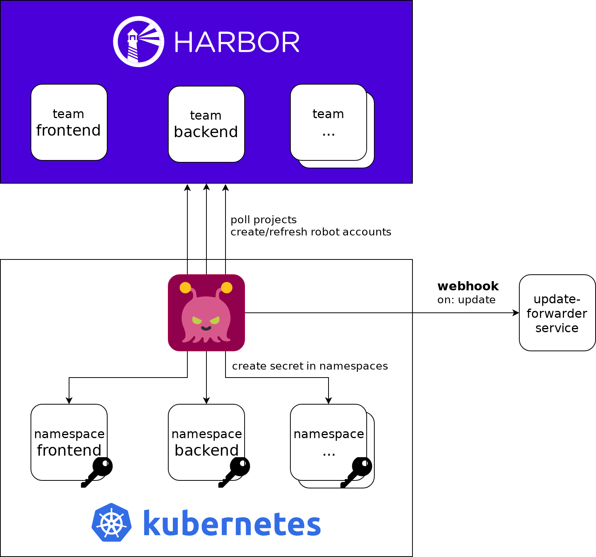

# Harbor Sync
 

Harbor Sync allows you to synchronize your Harbor robot accounts with your Kubernetes cluster.

## How it works
This project extends the Kubernetes API by adding a Custom Resource `HarborSync` and a controller that implements a reconciliation loop. This loop takes care of creating and refreshing robot account tokens aswell as distributing the tokens into your namespaces as secrets.

A `HarborSync` defines which Harbor projects should be synced with which namespaces.

## Documentation
You can find the documentation [here](http://moolen.github.io/harbor-sync).

## Status
This project is in alpha state, we do not offer strong guarantees for our API interface.
We will introduce breaking changes before the 1.0 release.

### Contributions

Pull requests are welcome!
* Read [CONTRIBUTING.md](./CONTRIBUTING.md) and check out [help wanted](https://github.com/moolen/harbor-sync/labels/help%20wanted) issues.
* Please submit github issues for feature requests, bugs or documentation problems
* Questions/comments and support can be posted as [github issue](https://github.com/moolen/harbor-sync/issues).
